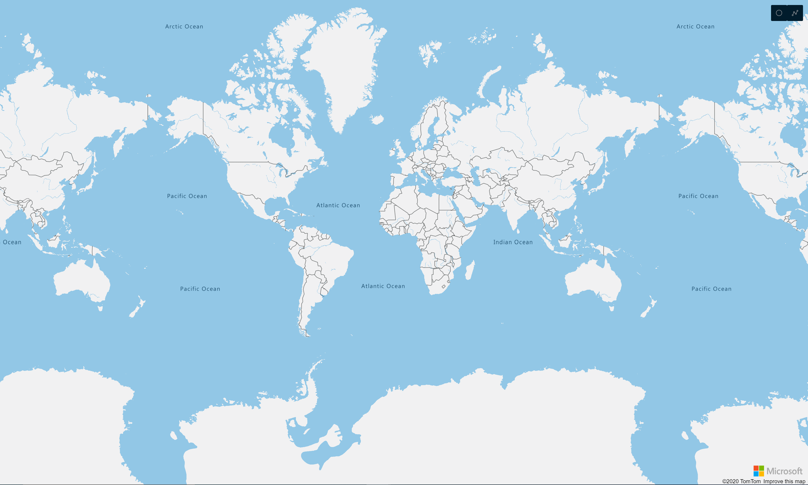

## Drawing Toolbar



A Drawing toolbar can be added to the map by providing the `DrawingToolbarOptions` parameter on the `AzureMap` component. You will need to include the following css and script into your application :

```
<link rel="stylesheet" href="https://atlas.microsoft.com/sdk/javascript/drawing/0.1/atlas-drawing.min.css" type="text/css" />
```

```
<script src="https://atlas.microsoft.com/sdk/javascript/drawing/0.1/atlas-drawing.min.js"></script>
```

```
@page "/DrawingToolbar"

@using AzureMapsControl.Components.Map
<AzureMap Id="map" DrawingToolbarOptions="new Components.Drawing.DrawingToolbarOptions
                                 {
                                     Buttons = new []
                                     {
                                         AzureMapsControl.Components.Drawing.DrawingButton.DrawCircle,
                                         AzureMapsControl.Components.Drawing.DrawingButton.DrawLine
                                     },
                                     Position = Components.Controls.ControlPosition.TopRight,
                                     Style = AzureMapsControl.Components.Drawing.DrawingToolbarStyle.Dark,
                                     Events = AzureMapsControl.Components.Drawing.DrawingToolbarEventActivationFlags.All()
                                 }"
          OnDrawingModeChanged="OnDrawingModeChanged"
          />

@code {
    public async Task OnDrawingModeChanged(AzureMapsControl.Components.Drawing.DrawingToolbarModeEventArgs eventArgs)
    {
        Console.WriteLine(eventArgs.NewMode);
    }
}
```

It can also be added once the map is ready.

```
@page "/DrawingToolbarOnReady"

@using AzureMapsControl.Components.Map
<AzureMap Id="map"
          OnReady="MapReady"
          EventActivationFlags="MapEventActivationFlags.None().Enable(MapEventType.Ready)"/>

@code {
    public async Task MapReady(MapEventArgs eventArgs)
    {
        await eventArgs.Map.AddDrawingToolbarAsync(new Components.Drawing.DrawingToolbarOptions
        {
            Buttons = new[]
                                     {
                                         AzureMapsControl.Components.Drawing.DrawingButton.DrawCircle,
                                         AzureMapsControl.Components.Drawing.DrawingButton.DrawLine
                                     },
            Position = Components.Controls.ControlPosition.TopRight,
            Style = AzureMapsControl.Components.Drawing.DrawingToolbarStyle.Dark
        });
    }
}
```

### Events

You can specify the events to enable or disable on the `DrawingToolbarOptions` of the toolbar. By default, all events are deactivated. The following events are available : 

| Event | Description |
| -- | -- |
| `DrawingChanged` | Fired when any coordinate in a shape has been added or changed. |
| `DrawingChanging` | Fired when any preview coordinate for a shape is being displayed. For example, this event will fire multiple times as a coordinate is dragged. |
| `DrawingComplete` | Fired when a shape has finished being drawn or taken out of edit mode. |
| `DrawingModeChanged` | Fired when the drawing mode has changed. The new drawing mode is passed into the event handler. |
| `DrawingStarted` | Fired when the user starts drawing a shape or puts a shape into edit mode. |

Those events are also triggered by the `Map` property on `IMapService`.

### Updating the toolbar

The toolbar can be updated using the `UpdateDrawingToolbarAsync` method on the map and providing the options to update the toolbar with.

```
@page "/DrawingToolbarUpdate"

@using AzureMapsControl.Components.Map
<AzureMap Id="map"
          DrawingToolbarOptions="new Components.Drawing.DrawingToolbarOptions
                                 {
                                     Buttons = new []
                                     {
                                         AzureMapsControl.Components.Drawing.DrawingButton.DrawCircle,
                                         AzureMapsControl.Components.Drawing.DrawingButton.DrawLine
                                     },
                                     Position = Components.Controls.ControlPosition.TopRight,
                                     Style = AzureMapsControl.Components.Drawing.DrawingToolbarStyle.Dark
                                 }"
          EventActivationFlags="MapEventActivationFlags.None().Enable(MapEventType.Ready)"
          OnReady="MapReady" />

@code {
    public async Task MapReady(MapEventArgs eventArgs)
    {
        var options = AzureMapsControl.Components.Drawing.DrawingToolbarUpdateOptions.FromOptions(eventArgs.Map.DrawingToolbarOptions);
        options.Buttons = new[]
        {
            AzureMapsControl.Components.Drawing.DrawingButton.DrawCircle,
            AzureMapsControl.Components.Drawing.DrawingButton.DrawLine,
            AzureMapsControl.Components.Drawing.DrawingButton.DrawPolygon
        };

        options.Style = AzureMapsControl.Components.Drawing.DrawingToolbarStyle.Light;
        options.Position = Components.Controls.ControlPosition.TopLeft;
        options.NumColumns = 1;

        await eventArgs.Map.UpdateDrawingToolbarAsync(options);
    }
}
```

### Removing the toolbar

The toolbar can be removed by calling the `RemoveDrawingToolbarAsync` method on the map.