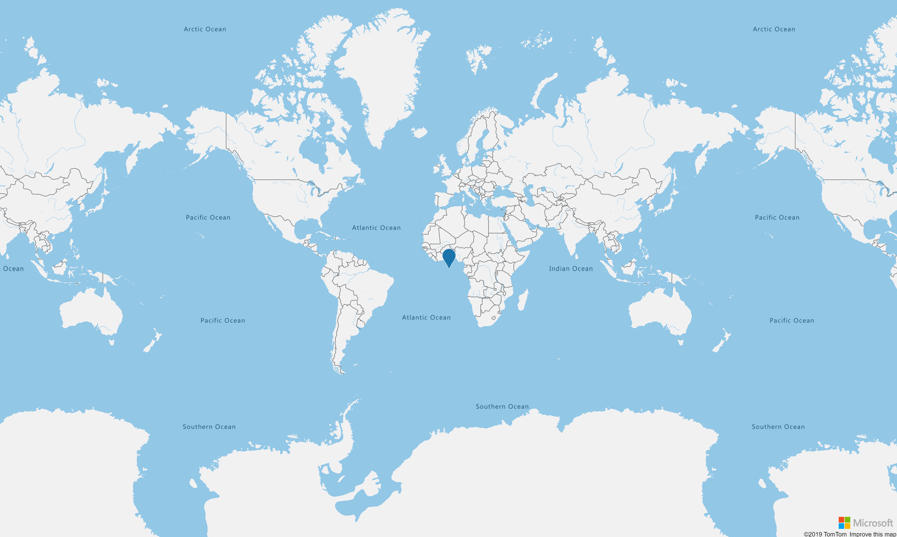

## HTML Markers

 

HTML Markers can be added directly on the map using the `HtmlMarkers` property on the `AzureMap` component.

```
@page "/HtmlMarkers"

@using AzureMapsControl.Components.Map
<AzureMap Id="map"
          HtmlMarkers="new [] {
                           new AzureMapsControl.Components.Markers.HtmlMarker(
                               new Components.Markers.HtmlMarkerOptions
                               {
                                   Position = new Components.Atlas.Position(0, 0),
                                   Draggable = true
                               })
                       }" />
```

They can also be added programmatically using the `AddHtmlMarkersAsync` method available on the map. The following example adds a marker to the map once its `ready` event has been triggered.

```
@page "/HtmlMarkersOnReady"

@using AzureMapsControl.Components.Map
<AzureMap Id="map"
          EventActivationFlags="MapEventActivationFlags
                                .None()
                                .Enable(MapEventType.Ready)"
          OnReady="OnMapReady"/>

@code  {
    public async Task OnMapReady(MapEventArgs events)
    {
        await events.Map.AddHtmlMarkersAsync
        (
            new AzureMapsControl.Components.Markers.HtmlMarker(
            new Components.Markers.HtmlMarkerOptions
            {
                Position = new Components.Atlas.Position(0, 0),
                Draggable = true
            })
        );
    }
}
```

More information concerning the HtmlMarkers can be found on the [Azure Maps Documentation](https://docs.microsoft.com/en-us/azure/azure-maps/map-add-custom-html).

### Enable and disable events

Just like for the `AzureMap`, you can enable or disable events on each HtmlMarker. To do so, you can provide the `HtmlMarkerEventActivationFlags` while creating a new HtmlMarker. The following example adds an `HtmlMarker` with only the `click` event activated.

```
@page "/HtmlMarkers"

@using AzureMapsControl.Components.Map
<AzureMap Id="map"
          EventActivationFlags="MapEventActivationFlags
                                .None()
                                .Enable(MapEventType.Ready)"
          OnReady="OnMapReady" />

@code  {

    public async Task OnMapReady(MapEventArgs events)
    {
        var marker = new AzureMapsControl.Components.Markers.HtmlMarker(
            new Components.Markers.HtmlMarkerOptions
            {
                Position = new Components.Atlas.Position(0, 0),
                Draggable = true
            },
            AzureMapsControl.Components.Markers.HtmlMarkerEventActivationFlags.None().Enable(AzureMapsControl.Components.Markers.HtmlMarkerEventType.Click));

        await events.Map.AddHtmlMarkersAsync(marker);
    }
}
```

### React to events on HtmlMarkers

You can subscribe to events on an instance of the `HtmlMarker` class. By default, all the events are deactivated. The following events are supported :

| Native event key | HtmlMarker event | Description |
| -- | -- | -- |
| `click` | `OnClick` | Fired when a pointing device is pressed and released at the same point on the marker. |
| `contextmenu` | `OnContextMenu` | Fired when the right button of the mouse is clicked on the marker. |
| `dblclick` | `OnDbClick` | Fired when a pointing device is clicked twice at the same point on the marker. |
| `drag` | `OnDrag` | Fired repeatedly during a "drag to pan" interaction on the HTML marker. |
| `dragend` | `OnDragEnd` | Fired when a "drag to pan" interaction ends on the HTML marker. |
| `dragstart` | `OnDragStart` | Fired when a "drag to pan" interaction starts on the HTML marker. |
| `keydown` | `OnKeyDown` | Fired when key is pressed down on the HTML marker. |
| `keypress` | `OnKeyPress` | Fired when key is pressed on the HTML marker. |
| `keyup` | `OnKeyUp` | Fired when key is pressed up on the HTML marker. |
| `mousedown` | `OnMouseDown` | Fired when a pointing device is pressed within the HTML marker or when on top of an element. |
| `mouseenter` | `OnMouseEnter` | Fired when a pointing device is initially moved over the HTML marker or an element. |
| `mouseleave` | `OnMouseLeave` | Fired when a pointing device is moved out the HTML marker or an element. |
| `mousemove` | `OnMouseMove` | Fired when a pointing device is moved within the HTML marker or an element. |
| `mouseout` | `OnMouseOut` | Fired when a point device leaves the HTML marker's canvas our leaves an element. |
| `mouseover` | `OnMouseOver` | Fired when a pointing device is moved over the HTML marker or an element. |
| `mouseup` | `OnMouseUp` | Fired when a pointing device is released within the HTML Marker or when on top of an element. |

The following example suscribes to the `click` event on an `HtmlMarker`.

```
@page "/HtmlMarkers"

@using AzureMapsControl.Components.Map
<AzureMap Id="map"
          EventActivationFlags="MapEventActivationFlags
                                .None()
                                .Enable(MapEventType.Ready)"
          OnReady="OnMapReady" />

@code  {

    public async Task OnMapReady(MapEventArgs events)
    {
        var marker = new AzureMapsControl.Components.Markers.HtmlMarker(
            new Components.Markers.HtmlMarkerOptions
            {
                Position = new Components.Atlas.Position(0, 0),
                Draggable = true
            },
            AzureMapsControl.Components.Markers.HtmlMarkerEventActivationFlags.None().Enable(AzureMapsControl.Components.Markers.HtmlMarkerEventType.Click));

        marker.OnClick += (args) =>
        {
            //Do something when the marker has been clicked
        };

        await events.Map.AddHtmlMarkersAsync(marker);
    }
}
```

### Update an HtmlMarker

You can update an `HtmlMarker` using the `UpdateHtmlMarkersAsync` method available on the map by passing an `HtmlMarkerUpdate`containing the previously created `HtmlMarker` and the options to update. 

The following example updates an `HtmlMarker` by changing its color when the mouse goes over it. 

```
@page "/HtmlMarkersUpdate"

@using AzureMapsControl.Components.Map
<AzureMap Id="map"
          EventActivationFlags="MapEventActivationFlags
                                .None()
                                .Enable(MapEventType.Ready)"
          OnReady="OnMapReady" />

@code  {
    
    public async Task OnMapReady(MapEventArgs events)
    {
        var markerColor = "#0000FF";
        var overColor = "#FF0000";
        var marker = new AzureMapsControl.Components.Markers.HtmlMarker(
            new Components.Markers.HtmlMarkerOptions
            {
                Position = new Components.Atlas.Position(0, 0),
                Draggable = true,
                Color = markerColor
            },
            AzureMapsControl.Components.Markers.HtmlMarkerEventActivationFlags.None().Enable(
                AzureMapsControl.Components.Markers.HtmlMarkerEventType.MouseEnter, 
                AzureMapsControl.Components.Markers.HtmlMarkerEventType.MouseLeave)
            );


        marker.OnMouseEnter += async (args) =>
        {
            var updatedOptions = new AzureMapsControl.Components.Markers.HtmlMarkerOptions
            {
                Color = overColor
            };

            await args.Map.UpdateHtmlMarkersAsync(new Components.Markers.HtmlMarkerUpdate(marker, updatedOptions));
        };

        marker.OnMouseLeave += async (args) =>
        {
            var updatedOptions = new AzureMapsControl.Components.Markers.HtmlMarkerOptions
            {
                Color = markerColor
            };

            await args.Map.UpdateHtmlMarkersAsync(new Components.Markers.HtmlMarkerUpdate(marker, updatedOptions));
        };

        await events.Map.AddHtmlMarkersAsync(marker);
    }
}
```

### Remove HtmlMarkers

The map also gives you the possibility to remove HTML markers using the `RemoveHtmlMarkersAsync` method. The following example adds an html marker to the map and removes the previously added one.

```
@page "/HtmlMarkersRemove"

@using AzureMapsControl.Components.Map
<AzureMap Id="map"
          EventActivationFlags="MapEventActivationFlags
                                .None()
                                .Enable(MapEventType.Click)"
          OnClick="OnMapClick" />

@code  {

    private AzureMapsControl.Components.Markers.HtmlMarker _marker;

    public async Task OnMapClick(MapMouseEventArgs args)
    {
        if(_marker != null)
        {
            await args.Map.RemoveHtmlMarkersAsync(_marker);
        }

        _marker = new AzureMapsControl.Components.Markers.HtmlMarker(
            new Components.Markers.HtmlMarkerOptions
            {
                Position = args.Position
            }, AzureMapsControl.Components.Markers.HtmlMarkerEventActivationFlags.None());
        await args.Map.AddHtmlMarkersAsync
        (
            _marker
        );
    }
}
```

A `ClearHtmlMarkersAsync` method on the map also allows you to remove all the HTML Markers.