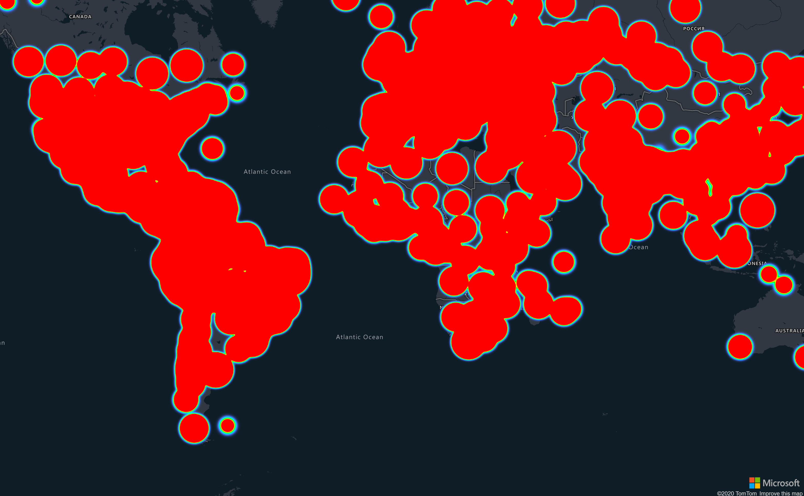

## Heatmap Layer

Heat maps, also known as point density maps, are a type of data visualization. They're used to represent the density of data using a range of colors and show the data "hot spots" on a map. Heat maps are a great way to render datasets with large number of points.



The `Heatmap Layer` requires a data source. The ID of the datasource to bind to the layer can be set on the `Source` property of the options of the layer.

```
@page "/HeatmapLayerOnReady"

@using AzureMapsControl.Components.Map
<AzureMap Id="map"
          Zoom="2"
          Style="grayscale_dark"
          EventActivationFlags="MapEventActivationFlags
                                .None()
                                .Enable(MapEventType.Ready)"
          OnReady="OnMapReady" />

@code  {
    public async Task OnMapReady(MapEventArgs events)
    {
        const string dataSourceId = "heatmapDataSource";
        var dataSource = new AzureMapsControl.Components.Data.DataSource(dataSourceId);
        await events.Map.AddSourceAsync(dataSource);
        await dataSource.ImportDataFromUrlAsync("https://services1.arcgis.com/0MSEUqKaxRlEPj5g/arcgis/rest/services/ncov_cases/FeatureServer/1/query?where=1%3D1&f=geojson&outFields=*");

        var layer = new AzureMapsControl.Components.Layers.HeatmapLayer
        {
            Options = new Components.Layers.HeatmapLayerOptions
            {
                //This will get converted to ['get', 'Confirmed']
                Weight = new Components.Atlas.ExpressionOrNumber(
                    new AzureMapsControl.Components.Atlas.Expression[]
                    {
                        new AzureMapsControl.Components.Atlas.ExpressionOrString("get"),
                        new AzureMapsControl.Components.Atlas.ExpressionOrString("Confirmed"),
                    }
                ),
                Radius = new Components.Atlas.ExpressionOrNumber(20),
                Source = dataSourceId
            }
        };

        await events.Map.AddLayerAsync(layer);
    }
}
```