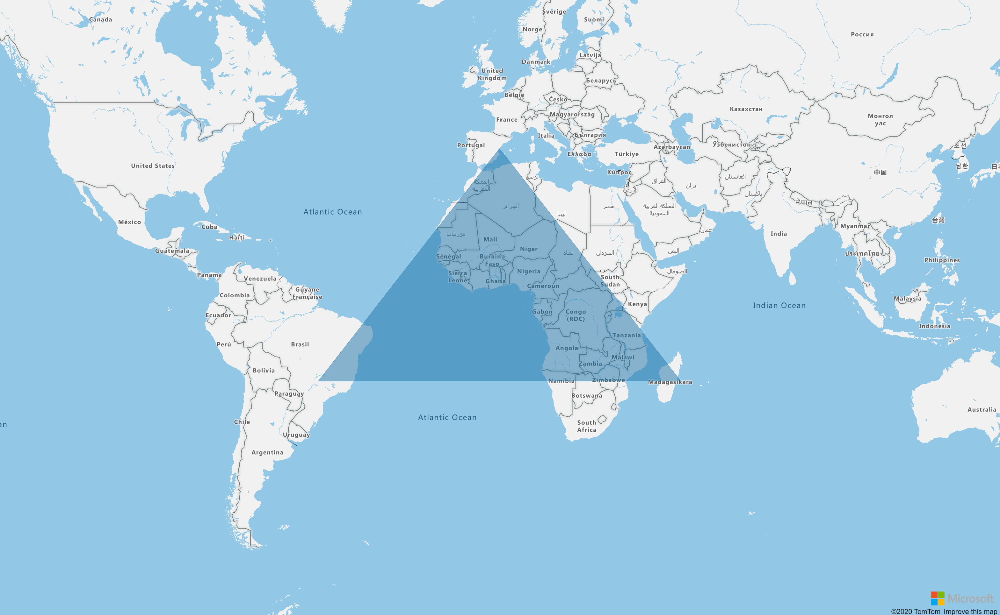

## Polygon Layer

A Polygon Layer renders the areas of `Polygon` and `MultiPolygon` feature geometries on the map using a polygon layer.



```
@page "/PolygonLayerOnReady"

@using AzureMapsControl.Components.Map
<AzureMap Id="map"
          Zoom="2"
          EventActivationFlags="MapEventActivationFlags
                                .None()
                                .Enable(MapEventType.Ready)"
          OnReady="OnMapReady" />

@code  {
    public async Task OnMapReady(MapEventArgs events)
    {
        const string dataSourceId = "dataSource";
        var dataSource = new AzureMapsControl.Components.Data.DataSource(dataSourceId);
        await events.Map.AddDataSourceAsync(dataSource);

        var polygon = new AzureMapsControl.Components.Atlas.Polygon(new[]
        {
            new []
{
                new AzureMapsControl.Components.Atlas.Position(-50, -20),
                new AzureMapsControl.Components.Atlas.Position(0, 40),
                new AzureMapsControl.Components.Atlas.Position(50, -20),
                new AzureMapsControl.Components.Atlas.Position(-50, -20),
            }
        });

        await dataSource.AddAsync(polygon);

        var layer = new AzureMapsControl.Components.Layers.PolygonLayer
        {
            Options = new Components.Layers.PolygonLayerOptions
            {
                Source = dataSourceId,
                FillOpacity = new Components.Atlas.ExpressionOrNumber(0.5),
                FillColor = new Components.Atlas.ExpressionOrString("#1a73aa")
            }
        };

        await events.Map.AddLayerAsync(layer);
    }
}
```