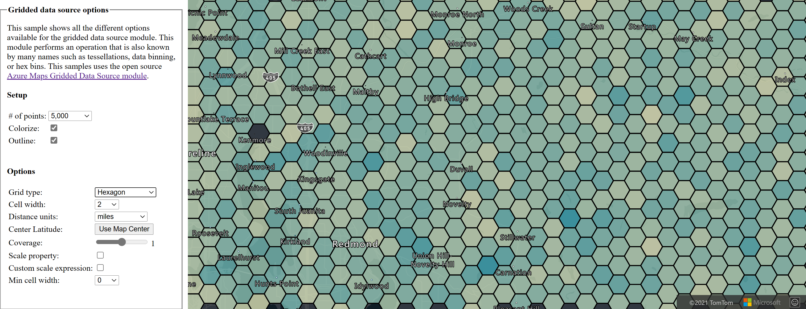

## Gridded Datasource

The `Gridded Datasource` is not part of the `atlas` library, so you need to include the js file of the control into your application and reference it with a `script` tag on your razor page. It can be found on the [GitHub repository of the gridded datasource module](https://github.com/Azure-Samples/azure-maps-gridded-data-source).

This datasource clusters data points into cells of a grid area.

 

```
@page "/Sources/GriddedDatasourceOptions"
@using AzureMapsControl.Components.Map
@inject AzureMapsControl.Components.Map.IMapService MapService

<style>
    .sidePanel {
        width: 325px;
        height: 580px;
        float: left;
        margin-right: 10px;
    }

    #map {
        position: relative;
        width: calc(100% - 375px);
        min-width: 290px;
        height: 600px;
        float: left;
    }
</style>

<fieldset class="sidePanel">
    <legend><h1 style="font-size:16px">Gridded data source options</h1></legend>
    This sample shows all the different options available for the gridded data source module.
    This module performs an operation that is also known by many names such as tessellations, data binning, or hex bins.
    This samples uses the open source
    <a href="https://github.com/Azure-Samples/azure-maps-gridded-data-source" target="_blank">Azure Maps Gridded Data Source module</a>.
    <br />
    <br />

    <b>Setup</b>
    <br />
    <br />
    <table>
        <tr title="Number of mock data points to generate.">
            <td># of points:</td>
            <td>
                <select @onchange="ChangeNumberOfPoints">
                    <option value="1000">1,000</option>
                    <option selected="selected" value="5000">5,000</option>
                    <option value="10000">10,000</option>
                    <option value="50000">50,000</option>
                    <option value="100000">100,000</option>
                    <option value="150000">150,000</option>
                    <option value="300000">300,000</option>
                    <option value="500000">500,000</option>
                    <option value="750000">750,000</option>
                    <option value="1000000">1,000,000</option>
                </select>
            </td>
        </tr>
        <tr title="Apply a data driven style to the polygon layer based an aggregate property.">
            <td>Colorize:</td>
            <td>
                <input type="checkbox" checked="checked" @onchange="ToggleColor" />
            </td>
        </tr>
        <tr title="Specifies if the cells should be outlined">
            <td>Outline:</td>
            <td>
                <input type="checkbox" checked="checked" @onchange="@ToggleOutline" />
            </td>
        </tr>
    </table>
    <br />
    <br />
    <b>Options</b>
    <br />
    <br />
    <table>
        <tr title="The type of grid to create.">
            <td>Grid type:</td>
            <td>
                <select @onchange="ChangeGridType">
                    <option value="@Components.Data.Grid.GridType.Circle.ToString()">Circle</option>
                    <option selected="selected" value="@Components.Data.Grid.GridType.Hexagon.ToString()">Hexagon</option>
                    <option value="@Components.Data.Grid.GridType.HexCircle.ToString()">Hex Circle</option>
                    <option value="@Components.Data.Grid.GridType.PointyHexagon.ToString()">Pointy Hexagon</option>
                    <option value="@Components.Data.Grid.GridType.Square.ToString()">Square</option>
                    <option value="@Components.Data.Grid.GridType.Triangle.ToString()">Triangle</option>
                </select>
            </td>
        </tr>
        <tr title="The width of each cell in the grid.">
            <td>Cell width:</td>
            <td>
                <select @onchange="ChangeCellWidth">
                    <option value="0.1">0.1</option>
                    <option value="0.5">0.5</option>
                    <option value="1">1</option>
                    <option selected="selected" value="2">2</option>
                    <option value="5">5</option>
                    <option value="10">10</option>
                    <option value="50">50</option>
                    <option value="75">75</option>
                    <option value="100">100</option>
                    <option value="200">200</option>
                    <option value="300">300</option>
                    <option value="400">400</option>
                    <option value="500">500</option>
                </select>
            </td>
        </tr>
        <tr title="Distance units of cell widths.">
            <td>Distance units:</td>
            <td>
                <select @onchange="ChangeDistanceUnits">
                    <option value="@Components.Atlas.Math.DistanceUnits.Feet">feet</option>
                    <option value="@Components.Atlas.Math.DistanceUnits.Kilometers">kilometers</option>
                    <option value="@Components.Atlas.Math.DistanceUnits.Meters">meters</option>
                    <option selected="selected" value="@Components.Atlas.Math.DistanceUnits.Miles">miles</option>
                    <option value="@Components.Atlas.Math.DistanceUnits.NauticalMiles">nauticalMiles</option>
                    <option value="@Components.Atlas.Math.DistanceUnits.Yards">yards</option>
                </select>
            </td>
        </tr>
        <tr title="Latitude value used to convert spatial distances to pixel distances.">
            <td>Center Latitude:</td>
            <td>
                <input type="button" @onclick="UpdateCenterLatitude" value="Use Map Center" />
            </td>
        </tr>
        <tr title="Coverage area to fill for each cell area.">
            <td>Coverage:</td>
            <td>
                <form oninput="c.value=coverage.value">
                    <input type="range" id="coverage" value="1" min="0" max="2" step="0.05" @oninput="UpdateCoverage" @onchange="UpdateCoverage" style="width:100px" />
                    <output name="c" for="coverage">1</output>
                </form>
            </td>
        </tr>
        <tr title="The property to use for scaling each cell.">
            <td>Scale property:</td>
            <td>
                <input type="checkbox" @onchange="ToggleScale" />
            </td>
        </tr>
        <tr title="USe a custom scale expression for scaling each cell.">
            <td>Custom scale expression:</td>
            <td>
                <input type="checkbox" @onchange="ToggleScaleExpression" />
            </td>
        </tr>
        <tr title="Minimium cell width of each grid cell when scaling.">
            <td>Min cell width:</td>
            <td>
                <select @onchange="ChangeMinCellWidth">
                    <option selected="selected" value="0">0</option>
                    <option value="0.1">0.1</option>
                    <option value="0.5">0.5</option>
                    <option value="1">1</option>
                    <option value="2">2</option>
                    <option value="5">5</option>
                    <option value="10">10</option>
                    <option value="50">50</option>
                    <option value="75">75</option>
                    <option value="100">100</option>
                    <option value="200">200</option>
                    <option value="300">300</option>
                    <option value="400">400</option>
                    <option value="500">500</option>
                </select>
            </td>
        </tr>
    </table>
</fieldset>

<AzureMap Id="map"
          EventActivationFlags="MapEventActivationFlags
                                .None()
                                .Enable(MapEventType.Ready, MapEventType.SourceAdded)"
          CameraOptions="CameraOptions"
          StyleOptions="StyleOptions"
          OnReady="OnMapReady"
          OnSourceAdded="OnSourceAdded" />

@code {
    private readonly string _datasourceId = "datasourceId";
    private static readonly Components.Atlas.Position _center = new(-122.3378, 47.6129);

    private Components.Data.Grid.GriddedDataSource _datasource;
    private Components.Layers.PolygonLayer _layer;
    private Components.Layers.LineLayer _outlineLayer;
    private Components.Map.Map _map;

    public CameraOptions CameraOptions = new CameraOptions { Center = _center, Zoom = 10 };

    public StyleOptions StyleOptions = new StyleOptions { Style = MapStyle.GrayscaleDark };

    public async Task OnMapReady(MapEventArgs eventArgs)
    {
        _map = eventArgs.Map;
        _datasource = new Components.Data.Grid.GriddedDataSource(_datasourceId)
            {
                Options = new Components.Data.Grid.GriddedDataSourceOptions
                {
                    CellWidth = 2,
                    DistanceUnits = Components.Atlas.Math.DistanceUnits.Miles,
                    AggregateProperties = new Dictionary<string, Components.Atlas.Expression> {
                        { "total", new Components.Atlas.Expression(System.Text.Json.JsonDocument.Parse("[\"+\", [\"get\", \"value\"]]")) }
                    }
                }
            };
        await eventArgs.Map.AddSourceAsync(_datasource);
    }

    public async Task OnSourceAdded(MapSourceEventArgs eventArgs)
    {
        _layer = new Components.Layers.PolygonLayer
            {
                Options = new Components.Layers.PolygonLayerOptions
                {
                    Source = _datasource.Id,
                    FillColor = new Components.Atlas.ExpressionOrString(System.Text.Json.JsonDocument.Parse("[\"interpolate\", [\"linear\"], [\"get\", \"total\", [\"get\", \"aggregateProperties\"]], 0, \"#ffffcc\", 1000, \"#41b6c4\", 10000, \"#253494\"]")),
                    FillOpacity = new Components.Atlas.ExpressionOrNumber(0.7)
                }
            };

        _outlineLayer = new Components.Layers.LineLayer
            {
                Options = new Components.Layers.LineLayerOptions
                {
                    Source = _datasource.Id,
                    StrokeColor = new Components.Atlas.ExpressionOrString("black")
                }
            };

        await eventArgs.Map.AddLayerAsync(_layer, "labels");
        await eventArgs.Map.AddLayerAsync(_outlineLayer, "labels");

        await UpdateNumPointsAsync(5000);
    }

    public async Task UpdateNumPointsAsync(int numPoints)
    {
        var points = new List<Components.Atlas.Feature<Components.Atlas.Point>>();
        var random = new Random();

        var camera = await _map.GetCameraOptionsAsync();
        var width = camera.Bounds.East - camera.Bounds.West;
        var height = camera.Bounds.North - camera.Bounds.South;

        for (var i = 0; i < numPoints; i++)
        {
            var longitude = random.NextDouble() * width + _center.Longitude;
            var latitude = random.NextDouble() * height + _center.Latitude;
            points.Add(
                new Components.Atlas.Feature<Components.Atlas.Point>(
                    new Components.Atlas.Point(
                        new Components.Atlas.Position(longitude, latitude)
                    )
                )
                    {
                        Properties = new Dictionary<string, object> { { "value", random.Next(0, 100) } }
                    }
            );
        }

        await _datasource.SetPointsAsync(points);
    }

    public async Task ChangeNumberOfPoints(ChangeEventArgs eventArgs)
    {
        await UpdateNumPointsAsync(int.Parse(eventArgs.Value.ToString()));
    }

    public async Task ChangeGridType(ChangeEventArgs eventArgs)
    {
        await _datasource.SetOptionsAsync(options => options.GridType = Components.Data.Grid.GridType.FromString(eventArgs.Value.ToString()));
    }

    public async Task ChangeCellWidth(ChangeEventArgs eventArgs)
    {
        await _datasource.SetOptionsAsync(options => options.CellWidth = double.Parse(eventArgs.Value.ToString()));
    }

    public async Task ChangeDistanceUnits(ChangeEventArgs eventArgs)
    {
        await _datasource.SetOptionsAsync(options => options.DistanceUnits = Components.Atlas.Math.DistanceUnits.FromString(eventArgs.Value.ToString()));
    }

    public async Task UpdateCenterLatitude()
    {
        await _datasource.SetOptionsAsync(options => options.CenterLatitude = _center.Latitude);
    }

    public async Task UpdateCoverage(ChangeEventArgs eventArgs)
    {
        await _datasource.SetOptionsAsync(options => options.Coverage = double.Parse(eventArgs.Value.ToString()));
    }

    public async Task ToggleColor(ChangeEventArgs eventArgs)
    {
        await _layer.SetOptionsAsync(options => options.FillColor =
            bool.TryParse(eventArgs.Value.ToString(), out var isChecked) && isChecked ?
            new Components.Atlas.ExpressionOrString(System.Text.Json.JsonDocument.Parse("[\"interpolate\", [\"linear\"], [\"get\", \"total\", [\"get\", \"aggregateProperties\"]], 0, \"#ffffcc\", 1000, \"#41b6c4\", 10000, \"#253494\"]"))
            : new Components.Atlas.ExpressionOrString("lightBlue"));
    }

    public async Task ToggleOutline(ChangeEventArgs eventArgs)
    {
        await _outlineLayer.SetOptionsAsync(options => options.Visible = bool.TryParse(eventArgs.Value.ToString(), out var isChecked) && isChecked);
    }

    public async Task ToggleScale(ChangeEventArgs eventArgs)
    {
        await _datasource.SetOptionsAsync(options => options.ScaleProperty = bool.TryParse(eventArgs.Value.ToString(), out var isChecked) && isChecked ? "point_count" : null);
    }

    public async Task ToggleScaleExpression(ChangeEventArgs eventArgs)
    {
        await _datasource.SetOptionsAsync(options => options.ScaleExpression = bool.TryParse(eventArgs.Value.ToString(), out var isChecked) && isChecked ? new Components.Atlas.Expression(System.Text.Json.JsonDocument.Parse("[\"^\", [\"/\", [\"get\", \"point_count\"], [\"get\", \"max\"]], 2]")) : null);
    }

    public async Task ChangeMinCellWidth(ChangeEventArgs eventArgs)
    {
        await _datasource.SetOptionsAsync(options => options.MinCellWidth = double.Parse(eventArgs.Value.ToString()));
    }
}
```